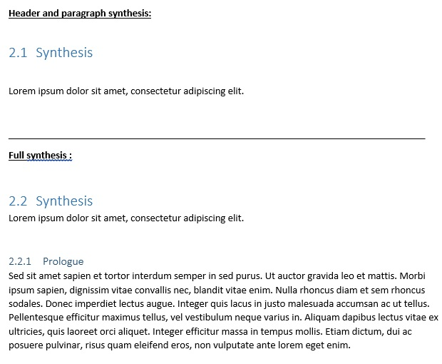
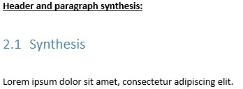

# MDdot

[](https://github.com/Titanexx/MDdot/stargazers)
[](https://github.com/Titanexx/MDdot/network)

## What is it? A new useless generation tools?

If you don't need a Word document at the end of an audit or a project, you're in luck!
But if you do need it and love markdown, you've come to the right place.

MDdot generates a Word file from a md file and a docx template.

You: `Hey wait a minute! As always, you fix many rules to use it and it is not usable in practice !`  
Me: `Well! No, no and just a little yes.`

You have to fill your Word template file with jinja2 variables, but you define the variables!

A hello world?

`python mddot -m examples/helloworld.md -d examples/helloworld.docx`


## Changelog

- Mk 1.6:
    + User:
        * Add styles
        * Add `_full_xml`, `_header_xml` endpoint
        * Add `mditems` python3/jinja2 endpoint for your templates
    + Internal
        * Fix import
        * Remove the unnecessary second rendering which causes some bug. (MDdot is faster !)
        * Add a internal dict class to add jinja2 capabilities in templating
- Mk 1.5:
    + User:
        * Add syntax highlighting inside code blocks with [pygments](https://pygments.org)
    + Internal:
        * Add getText methods in nodes
        * Remove the second rendering 
        * Remove Images module
- Mk 1.4:
    + User:
        * Fix bug if the MD contains jinja2 key-like strings
    + Internal:
        * Add modules possibilities
        * Add Images module
        * Add Files class to handle templating processing and cache
        * Refactor nodes to remove templating cache
- Mk 1.3:
    + User:
        * (BREAKING TEMPLATE) Add `.table` (1st table in a part) and `.tables` (if there are more than 1) endpoint to access `headers` and `data`
        * Fix bug when there 2 parts at same level and with the same name 
- Mk 1.2:
    + User: 
        * Fix image size 
        * Add a requirement_win64.txt with hash for security
    + Internal:
        * Text nodes are added as children to paragraph, table or list nodes
        * Creation of helpers method inside helpers.py
        * Add paragraph in the template cache for each detected jinja2 vars 
- Mk 1.1:
    + User:
        * Add mddottextcaption, mddottextlink styles
        * Add support of paragraph style for xml jinja variables
        * Update readme, add example
        * Add checkStyle to verify mddot styles inside template (style's type isn't checked) 
    + Internal:
        * Add id for each node
        * Add cache for style applied on a jinja2 var.
- Mk 1.0: Initial release

## Installation

You can use MDdot inside a virtualenv (or not).  
All dependencies are frozen inside the requirement.txt with their sha256 hashes to avoid wrong or malicious packets.

`pip install -r requirements.txt`

You can find the hashes on pypi.org like for [pillow](https://pypi.org/project/Pillow/#files)

## How to use it ?

MDdot is a CLI tool : `python mddot -m <your_markdown> -d <your_template> -o <your_destination>`  
You need help? Try `python mddot -h`

## How to fill your template?

MDdot uses [Jinja2 syntax](https://jinja.palletsprojects.com/en/2.11.x/).  
You can find some mddot examples in the [example folder](./examples)

If you want to discover python-docx-template (and Jinja2), try playing with their examples: [https://github.com/elapouya/python-docx-template/tree/master/tests](https://github.com/elapouya/python-docx-template/tree/master/tests)

### Custom docx style

MDdot can use specific word styles for some markdown elements.

You have to follow some rules to get a functional style: a paragraph style (like title) will not work as a character style.

The table describes the style's name and its type :

|         Name          | Character style | Paragraph style | Tables Style |
|:---------------------:|:---------------:|:---------------:|:------------:|
|     `mddottable`      |       No        |       Noe       |      Yes     |
|   `mddotheader<X>`    |       No        |       Yes       |      No      |
|   `mddotblockcode`    |       No        |       Yes       |      No      |
|  `mddottextcaption`   |       No        |       Yes       |      No      |
| `mddottextinlinecode` |       Yes       |       No        |      No      |
|   `mdddottextlink`    |       Yes       |       No        |      No      |

Note : for the lvl1 header, `mddotheader<X>` becomes `mddotheader1`

If you do not follow these guidelines, your style may not work and the generated document may be corrupted.

MDdot does not provide a default text style as you have only modify your default style in your document.

MDdot styles are not mandatory, as Word uses the default style if it cannot find them. 

### The variables name

The heading is the variable name. Each level heading is separated by a `.`.
All spaces or special characters are removed and the content is lowered: `self.id = re.sub(r'[^A-Za-z0-9]+', '', self.content).lower()`

#### Example:

Markdown :

```markdown
# First Heading
## Second Heading
```

Variable name: `firstheading.secondheading`:

### The `.xml` endpoint

Append `.xml` to a variable to "print" content.

This endpoint generates everything (or it should :see_no_evil: :hear_no_evil: :speak_no_evil:):
- List: 
    + Bullet list: you need to create the `mddotlistbullet` list style
    + Ordered List (default choice if the bullet list style is not found): create a list start from 1. It uses the word default-style list.  
- Array: if you want change the default table style, you need to set the  table style : `mddottable`
- Image: use `mddottextcaption` to custom your legend.
- Text markdown format:
    + Strong : `**amet**`
    + Emphasis : `*consectetur*`
    + Strikethrough : `~~adipiscing elit~~`
    + InlineCode : Custom the style with `mddottextinlinecode` (must be a character style)
        ```
        `Inline Code`
        ```
- Link : `(example.com)[example.com]` or `[](https://www.example.com)`, use `mddottextlink` to custom your links
- Code block : MDdot doesn't colorize the code if you add a language. It uses the style `mddotblockcode` which must be a paragraph style.

This endpoint support paragraph style from your template.
If you uses it inside a for loop, you have to use the list representation inside your loop (see the Styling example).

#### Example

##### Classic

```markdown
# First Heading
## Second Heading

test

```

Use `{{firstheading.secondheading.xml}}` to add `test` inside your document.

##### Styling example

```markdown
# test
## item 1
### good
test
### bad
test
## item 2
### good
test
### bad
test

```

Use `test[key].good.xml` with a paragraph style applied on it : 

```python

    {{ test[key].good.xml }}

```

See [stylingXml.md](examples/stylingXml.md) and [stylingXml.docx](examples/stylingXml.docx) for a simple example.

### Tables endpoint

You can use your own table style with `.headers` and `.data` endpoint on `.table` if you want the 1st table in a part or on `.tables` in a for loop.

#### Example

Markdown :

```markdown
## Contacts

| Name        | Function    | Mail                 | Phone      |
|:------------|:------------|:---------------------|:-----------|
| John Smith  | Lorem       | john.smith@acme.com  | 0123456789 |
| Bob Smith   | Ipsum       | bob.smith@acme.com   | 0123456789 |
| Alice Smith | Consectetur | alice.smith@acme.com | 0123456789 |

## Friends

| Name      | *Function*    | Mail               | Phone      |
|:----------|:--------------|:-------------------|:-----------|
| John Doe  | Porttitor     | john.doe@acme.com  | 0123456789 |
| Bob Doe   | Sed bibendum  | bob.doe@acme.com   | 0123456789 |
| Alice Doe | Massa commodo | alice.doe@acme.com | 0123456789 |

| Name         | *Function*    | Mail               | Phone      |
|:-------------|:--------------|:-------------------|:-----------|
| John Doe Jr  | Porttitor     | john.doe@acme.com  | 0123456789 |
| Bob Doe Jr   | Sed bibendum  | bob.doe@acme.com   | 0123456789 |
| Alice Doe Jr | Massa commodo | alice.doe@acme.com | 0123456789 |

```

Docx:


Result:


### The properties

You will need some variables which you can use everywhere, in a report.
You have to define a list after the heading with the id `properties`.
The separator between the name and the content is `:`.

Link, images and styling token isn't supported. Only text.

Code:

```markdown
- <key> : <content>

```

#### Example

Markdown:

```markdown
# Project
## Properties

- client : ACME
- project_name : ACME Project
- start_date : 01/01/1970
- end_date : 07/01/1970

```

Jinja2 key:

- `project.properties.client`
- `project.properties.project_name`
- `project.properties.start_date`
- `project.properties.end_date`

### Specific endpoints

All endpoints, which start with `_`, help to extend the templating capabilities.
There are not returned with the method `mditems` in your Jinja2/docx template.

#### `_full_xml`

The `_full_xml` endpoint can be used if you want "print" all contents inside elements, his children and the title.

If you want generate a docx file from a template where you have definied only the styles, use `{{ _full_xml }}` 

##### Examples

You can find 2 examples :
- a full document generation (`{{ _full_xml }}`) : `python.exe -m mddot -m .\examples\project.md -d .\examples\full_xml.docx`
- a full generation from a lvl2 header (`{{letter.synthesiss._full_xml }}`) : `python.exe -m mddot -m .\examples\project.md -d .\examples\full_xml.docx`



#### `_header_xml`

This endpoint is used to created a title from your md header.

#### Example

`{{ letter.synthesis._header_xml}}`



### Jinja2 MDdot methods

MDdot extends the Python dict class to add features inside template.

List of method:
- `mditems` : it's usefull to get only items linked from your markdown files (so you don't get the properties nodes,`_full_xml` or `_header_xml`, etc...)

## Todo list

`grep -rn todo .`

## Open Source Components

Docx generation:
- [python-docx-template](https://github.com/elapouya/python-docx-template) from [@elapouya](https://github.com/elapouya)
- [python-docx](https://github.com/python-openxml/python-docx).

Markdown parsing:
- [mistletoe](https://github.com/miyuchina/mistletoe)
- [pygments](https://pygments.org)

Logging:
- [python-verboselogs](https://github.com/xolox/python-verboselogs)
- [coloredlogs](https://pypi.org/project/coloredlogs/)

## License

MDdot is licensed under a proprietary license.  
The source code is licensed the CC BY-NC-SA 4.0 license.

You are not allowed to make a profit with it.

Examples:
- You can't use MDdot to generate a document for a customer without a proprietary license
- You can't integrate MDdot inside a paid software without a proprietary license
- If you are a bug hunter without any business affiliation, you can use it. (Don't hesitate to support the project :kissing_heart:)

If want buy a proprietary license, send a mail to [mddot@protonmail.com](mailto:mddot@protonmail.com).

A proprietary license brings you some advantages: 
- Direct mailing support (creation of templates, module development if needed)
- Bug fixes before GitHub (bug fixes are always released for all in a short time)
- Closed modules

## How to support

You can support the project by buying :beer: or :beers: [https://www.buymeacoffee.com/titanex](https://www.buymeacoffee.com/titanex)

The Word XML is a real :dizzy_face:.
