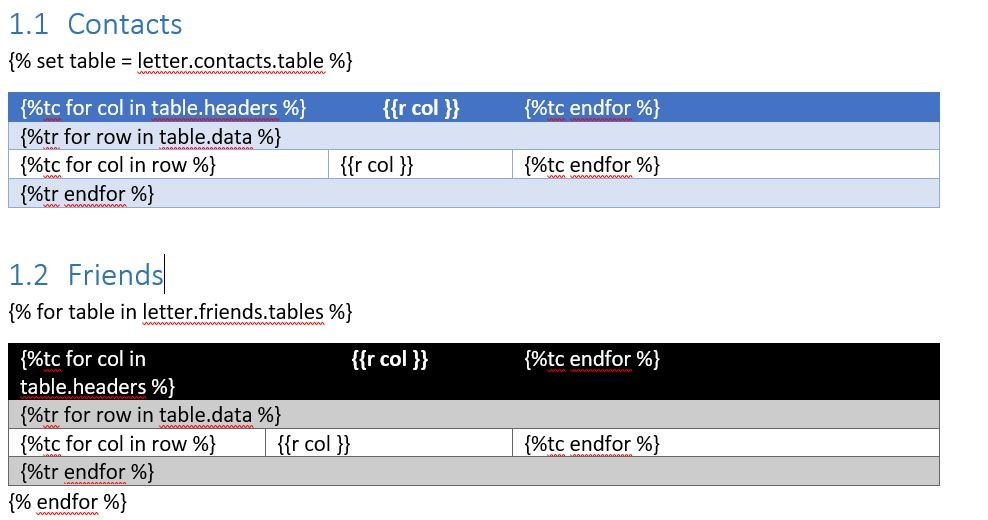

# MDdot

## What is it? A new useless generation tools?

If you don't need a Word document at the end of an audit or a project, you're in luck!
But if you do need it and love markdown, you've come to the right place.

MDdot generates a Word file from a md file and a docx template.

You: `Hey wait a minute! As always, you fix many rules to use it and it is not usable in practice !`
Me: `Well! No, no and just a little yes.`

You have to fill your Word template file with jinja2 variables, but you define the variables!

A hello world?

`python mddot -m examples/helloworld.md -d examples/helloworld.docx`


## How to use it ?

MDdot is a CLI tool : `python mddot -m <your_markdown> -d <your_template> -o <your_destination>`

You need help? Try `python mddot -h`

## How to fill your template?

MDdot uses [Jinja2 syntax](https://jinja.palletsprojects.com/en/2.11.x/).

You can find some mddot examples in the [example folder](./examples)

If you want to discover python-docx-template (and Jinja2), try playing with their examples: [https://github.com/elapouya/python-docx-template/tree/master/tests](https://github.com/elapouya/python-docx-template/tree/master/tests)

### The variables name

The heading is the variable name. Each level heading is separated by a `.`.
All spaces or special characters are removed and the content is lowered: `self.id = re.sub(r'[^A-Za-z0-9]+', '', self.content).lower()`

#### Example:

Markdown :

```markdown
# First Heading
## Second Heading
```

Variable name: `firstheading.secondheading`:

### The XML endpoint

Append `.xml` to a variable to "print" content.

This endpoint generates everything (or it should :see_no_evil: :hear_no_evil: :speak_no_evil:) :

- List :
    + Bullet list: you need to create the `mddotlistbullet` list style
    + Ordered List (default choice if the bullet list style is not found): create a list start from 1. It uses the word default-style list.
- Array: if you want change the default table style, you need to set the table style : `mddottable`
- Image: MDdot doesn't manage the size (for the moment :wink:)
- Text markdown format:
    + Strong : `**amet**`
    + Emphasis : `*consectetur*`
    + Strikethrough : `~~adipiscing elit~~`
    + InlineCode : Custom the style with `mddottextinlinecode` (must be a character style)
        ```
        `Inline Code`
        ```

- Link : `(example.com)[example.com]` or `[](https://www.example.com)`
- Code block : MDdot doesn't colorize the code if you add a language (for the moment :wink:). It uses the style `mddotblockcode` which must be a paragraph style.

#### Example

```markdown
# First Heading
## Second Heading

test

```

Use `{{firstheading.secondheading.xml}}` to add `test` inside your document.

### Tables endpoint

You can use your table style with `headers` and `data` endpoint.

#### Example

Markdown :

```markdown
## Contacts

| Name        | Function    | Mail                 | Phone      |
|:------------|:------------|:---------------------|:-----------|
| John Smith  | Lorem       | john.smith@acme.com  | 0123456789 |
| Bob Smith   | Ipsum       | bob.smith@acme.com   | 0123456789 |
| Alice Smith | Consectetur | alice.smith@acme.com | 0123456789 |

## Auditors

| Name      | *Function*    | Mail                | Phone      |
|:----------|:--------------|:--------------------|:-----------|
| John Doe  | Porttitor     | john.doe@wayne.com  | 0123456789 |
| Bob Doe   | Sed bibendum  | bob.doe@wayne.com   | 0123456789 |
| Alice Doe | Massa commodo | alice.doe@wayne.com | 0123456789 |
```

Docx:



Result:


### The properties

You will need some variables which you can use everywhere, in a report.
You have to define a list after the heading with the id `properties`.
The separator between the name and the content is `:`.

Link, images and styling token isn't supported. Only text.

Code:

```markdown
- <key> : <content>
```

#### Example

Markdown:

```markdown
# Project
## Properties

- client : ACME
- project_name : ACME Pentest
- start_date : 01/01/1970
- end_date : 07/01/1970
```

Jinja2 key:

- `project.properties.client`
- `project.properties.project_name`
- `project.properties.start_date`
- `project.properties.end_date`

## Todo list

`grep -rn todo .`

## Open Source Components

Docx generation:

- [python-docx-template](https://github.com/elapouya/python-docx-template) from [@elapouya](https://github.com/elapouya)
- [python-docx](https://github.com/python-openxml/python-docx).

Markdown parsing:

- [mistletoe](https://github.com/miyuchina/mistletoe)

Logging:

- [python-verboselogs](https://github.com/xolox/python-verboselogs)
- [coloredlogs](https://pypi.org/project/coloredlogs/)

Image for example:
[https://freepik.com/](https://freepik.com/)

## License

MDdot is licensed under a proprietary license.
The source code is licensed the CC BY-NC-SA 4.0 license.

You are not allowed to make a profit with it.

Examples:
- You can't use MDdot to generate a document for a customer without a proprietary license
- You can't integrate MDdot inside a paid software without a proprietary license
- If you are a bug hunter without any business affiliation, you can use it. (Don't hesitate to support the project :kissing_heart:)

If you want to buy license, you can contact me via mail [mddot@protonmail.com](mailto:mddot@protonmail.com).

## How to support

You can support the project by buying :beer: or :beers: [https://www.buymeacoffee.com/titanex](https://www.buymeacoffee.com/titanex)

The Word XML is a real :dizzy_face:.
